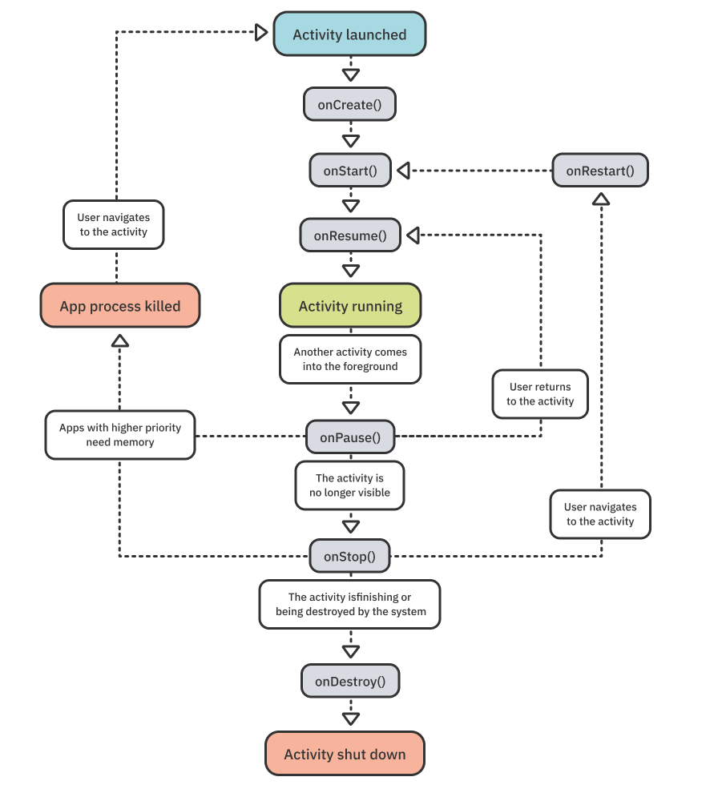
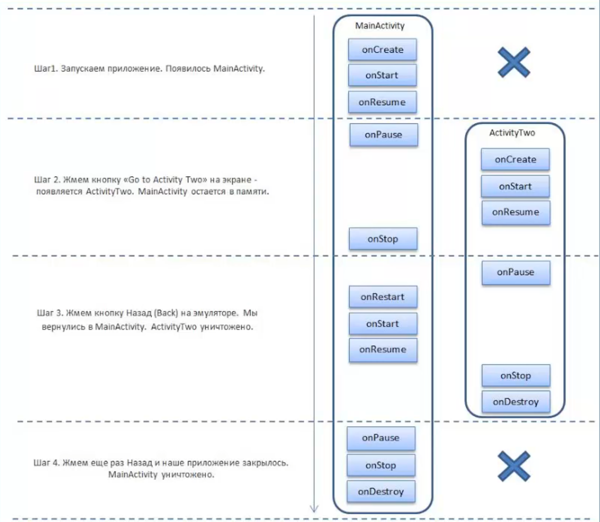

# Activity lifecycle

Каждая activity имеет свой жизненный цикл. Она рождается, живет, приостанавливается когда нужно и уничтожается. Мы не можем управлять напрямую созданием и удалением объекта activity, но на каждый этап ее жизни Android SDK предоставляет нам функции для работы с ней.

### Состояния

Состояний у Activity 3 штуки.

- **Resumed** взаимодействие с пользователем. 
- **Paused** не в фокусе, но его видно
- **Stopped** не в фокусе, его не видно 

**Состояние Resumed** - состояние, при котором activity <u>полностью</u> видна, она может отрабатывать UI отклики, Android может убить activity в этом состоянии только при краше приложения (ANR ошибка).

**Состояние Paused** - состояние фона. Когда activity находится сзади какого-то элемента, который в фокусе. Таким элементом может быть диалог, звонок, уведомление о низком заряде и тд. Уничтожается в крайних случаях, когда памяти нет вовсе.

**Состояние Stopped** - состояние, когда activity вообще не видно. Оно свернуто, пользователь ушел в другое приложение, либо навигировался на другой экран. Приоритетно для уничтожения при нехватке памяти.

### Функции

На вход/выход в каждое состояние жизненного цикла есть по методу. 
Всего их 6:
- `onCreate()` - создание Activity, за жизненный цикл вызывается всего 1 раз
- `onStart()` - возврат из состояния Stopped
- `onResume()` - возврат из состояния Paused
- `onPause()`- переход в Paused
- `onStop()` - переход в Stopped
- `onDestroy()` - очищение из памяти, вызывается 1 раз

Каждый из методов вызывается всего 1 раз за переход в его/из его состояния. При старте по очереди вызываются `onCreate` `onStart` `onResume` 

При этом надо понимать, что при открытии новой activity, она не будет показана, пока не выполнятся методы `onPause`, если это диалог и `onStop`, если это полностью новый экран. Поэтому важно оставлять эти методы легковесными и не выполнять там сложных операций, по типу закрытия БД и тд., особенно в `onPause`, так как он вызывается чаще всего.

### Lifecycle callbacks

