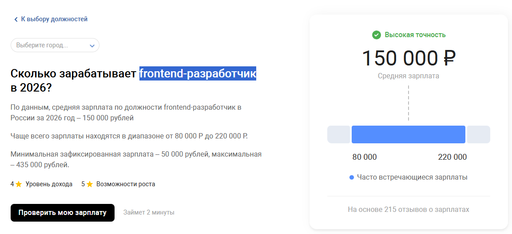

## Мобильная разработка 
или 
### Что такое Android и с чем его едят

**Начнем с одного из преимуществ Android разработки**

Зарплаты мобильных разработчиков достаточно высокие, если сравнивать с другими отраслями IT. 

Почему так? Конкуренция на рынке Android разработчиков гораздо ниже, чем на web. При этом крупные компании часто желают иметь свое приложение для работы с пользователями

### Почему именно мобильное приложение, а не сайт?

Причин достаточно много

**Мгновенный доступ**
У пользователя всегда под рукой нужное приложение. Не нужно запускать браузер, ждать, пока загрузится HTML, CSS, имеется оффлайн доступ (если такое предусмотрено)

**Больше кастомизации**
Благодаря Android цветовая схема приложений может совмещаться с той, что стоит у пользователя в системе. К примеру юзер выбрал темную тему и синеватые оттенки элементов, это можно подтянуть и в нашем приложении

**Больше возможностей**
Контакты, камера, микрофон, внутреннее хранилище, push-уведомления, фоновые службы - все это доступно нативно и без костылей.

**Спрос**
Все больше пользователей предпочитают тратить время в приложениях, когда ищут что-то, нежели на сайтах. Они доверяют источникам, которые уже установленны у них на телефоне. Приложение является более эффективным методом удержания пользователя.

### Что такое Android

Android - операционная система под мобильные и не только устройства. Имеет кучу ответвлений. 
Примеры устройств, которые носят Android:
- Смартфоны
- Часы (WearOS)
- Интерактивные панели
- Модули управления (hub умного дома, кассовые аппараты)
- Ноутбуки

В целом, Android - крайне гибкая система, позволяет выполнять сложные операции при ограниченных ресурсах. Построена на базе ядра Linux

Более подробно про Android будет рассказано в следующей лекции

### Особенности разработки под Android

Мобильная разработка достаточно разнообразна.

Часто приложение является вторым frontend-ом, который более удобен пользователю. Бывает, что фронт и мобилка при работе обращаются к одной и той же API. 

Но также приложение может быть и полностью автономным, особенно если ей не нужна собственная API об бека. Примеры:
- Программа для трекинга тренировок
- Редакторы текста
- Заметки
- Файловые менеджеры
- Медиа-проигрыватели 

Как можно видеть, Android может быть как фронтом, так и автономным приложением. Благодаря этому он умело совмещает минусы каждого направления.

**Адаптивность**
Устройств огромное количество, каждое из них имеет свои ресурсы, расширение экрана, поддерживаемые версии Android SDK и т.д.

Под все это нужно уметь подстраиваться. Это не является огромной проблемой, сама Android SDK очень лояльна с этой стороны к программисту, но все же иногда это создает лишних задач.

### Потребности разработчика

Для работы понадобится Android Studio и много оперативки на ПК (от 16гб минимум).

