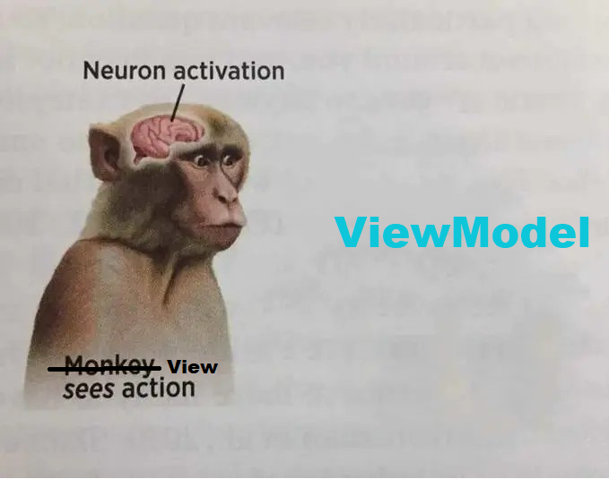

## Лекция 4 — Разделение UI и логики

### MVVM, состояние, LiveData, Flow и корутины

[Хорошо рассказано про MVVM здесь](https://www.youtube.com/watch?v=KeQWIu8bA-Y&list=PLeF3l86ZMVkLQbdRL6Ra4cr_cmPROj94y&index=6)

В предыдущей лекции мы познакомились с Activity, UI и жизненным циклом.
И если внимательно посмотреть на всё это вместе, возникает логичный вопрос:


**а где вообще должна жить логика приложения?**

Интуитивный ответ — в Activity.
Там же кнопки, там же экран, значит туда и пишем.

Именно с этого начинается большинство проблем в Android.

#### Почему UI не должен знать всё

Activity — крайне нестабильная сущность.
Она может быть уничтожена системой, пересоздана при повороте экрана или исчезнуть, когда пользователь просто свернул приложение.

Если вся логика и состояние живут внутри Activity, то при любом пересоздании экрана:

* данные теряются
* запросы повторяются
* интерфейс «мигает»
* появляются странные баги, которые сложно воспроизвести

Это не ошибка разработчика.
Это следствие архитектуры Android.

Отсюда появляется главная идея:
**UI не должен быть владельцем логики и состояния.**

#### Разделение ответственности

Android-приложение удобно рассматривать как систему из двух больших частей:

* интерфейс, который показывает состояние
* логика, которая это состояние формирует

UI должен уметь:

* отображать данные
* реагировать на действия пользователя

Но он не должен:

* хранить бизнес-логику
* решать, откуда брать данные
* управлять жизнью асинхронных операций

Именно для этого в Android появился архитектурный подход **MVVM**.

---

### MVVM как базовая модель мышления

MVVM расшифровывается как **Model – View – ViewModel**.

View — это UI. Activity или Fragment.
Она отображает данные и отправляет события.

ViewModel — это слой, который:

* хранит состояние экрана
* содержит логику
* не зависит от UI
* переживает пересоздание Activity

Model — это данные. Сеть, база, репозитории. До них мы дойдём позже.

Ключевая идея здесь в том, что **ViewModel живёт дольше, чем UI**.
Поворот экрана — UI пересоздался, ViewModel осталась.
Пользователь свернул приложение — состояние сохранилось.

И Android это поддерживает на уровне платформы.

#### ViewModel: где она живёт и как с ней работать

Типичная организация пакетов в Android-проекте с MVVM выглядит так:

```
ui/
 └── main/
     ├── MainActivity.kt
     ├── MainViewModel.kt
     └── MainState.kt (опционально)
```

Важное замечание:

ViewModel **не знает**, что Activity вообще существует.
Она не знает про кнопки, TextView, Context, lifecycle и всё остальное, связанное с отображением.

Если ViewModel начинает обращаться к View — архитектура сломана.


#### Создание ViewModel

ViewModel — это обычный класс, унаследованный от `ViewModel`, который предоставляет нам AndroidSDK:

```kotlin
class MainViewModel : ViewModel() {

    private val _counter = MutableLiveData(0)
    val counter: LiveData<Int> = _counter

    fun onIncrementClicked() {
        _counter.value = (_counter.value ?: 0) + 1
    }
}
```

Здесь сразу видно несколько принципиальных моментов.

ViewModel **хранит состояние экрана** (`_counter`). В нашем случае, это простой счетчик. О том, как оно работает, поговорим далее. 

Также ViewModel предоставляет методы, которые описывают *действия*, а не UI-события. То есть метод `onIncrementClicked` знает, что делать, когда нужно увеличить счетчик

Метод называется не `onButtonClick`, а, например, `onIncrementClicked` — логика, а не реализация.

#### Activity: создание и использование ViewModel

Activity — это View, представление, лицо. Главная задача здесь - показать данные, которые дала нам ViewModel.

Сейчас нужно создать ViewModel, подписаться на состояние, выводить его на экран и говорить ViewModel, что пользователь что-то нажал.

Создание ViewModel в Activity выглядит так:

```kotlin
class MainActivity : AppCompatActivity() {

    // Создаем нашу viewModel
    private val viewModel: MainViewModel by viewModels()

    override fun onCreate(savedInstanceState: Bundle?) {
        super.onCreate(savedInstanceState)
        // наполняем экран элементами
        setContentView(R.layout.activity_main)

        // находим на разметке наши элементы
        val textView = findViewById<TextView>(R.id.textView)
        val button = findViewById<Button>(R.id.button)

        // подписываемся на состояние в viewModel
        viewModel.counter.observe(this) { value ->
            textView.text = value.toString()
        }

        // при каждом нажатии на кнопку вызываем нужный метод
        // в viewModel
        button.setOnClickListener {
            viewModel.onIncrementClicked()
        }
    }
}
```

Здесь важно несколько вещей.

- Activity **не хранит состояние**.

- Если Activity будет уничтожена и пересоздана, ViewModel сохранится, и состояние не потеряется.
Именно ради этого всё и делается.

#### LiveData: как создаётся и как используется


Теперь подробнее про **LiveData**, потому что именно здесь часто возникает путаница.

LiveData — это контейнер для данных, за которыми может наблюдать UI.
Он всегда живёт **в ViewModel**, а не во View.

Объявляется она так:

```kotlin
private val _state = MutableLiveData<ScreenState>()
val state: LiveData<ScreenState> = _state
```

Почему так?

`MutableLiveData` позволяет **изменять значение**.
`LiveData` — только **читать и наблюдать**.

Таким образом:

* ViewModel может менять состояние
* UI может только наблюдать

Это защищает архитектуру от случайных изменений состояния из UI.

#### Изменение LiveData внутри ViewModel

Изменение состояния происходит **только внутри ViewModel**:

```kotlin
fun loadData() {
    _state.value = ScreenState.Loading
}
```

UI не знает, откуда пришли данные.
UI просто реагирует на новое состояние.

#### Подписка на LiveData в Activity

В Activity подписка выглядит максимально просто:

```kotlin
viewModel.state.observe(this) { state ->
    when (state) {
        is ScreenState.Loading -> showLoading()
        is ScreenState.Content -> showContent(state.data)
        is ScreenState.Error -> showError()
    }
}
```

Это и есть ключевая идея MVVM:
**UI реагирует на состояние, а не управляет логикой**.



---

### Ограничения LiveData и появление Flow

LiveData хорошо решает задачи UI, но у него есть ограничения.
Он тесно связан с Android и плохо подходит для сложных потоков данных.

Поэтому в Android всё чаще используется **Flow** — реактивный поток данных из Kotlin Coroutines.

Flow:

* не привязан к Android
* может эмитить значения со временем
* хорошо работает с асинхронностью
* легко комбинируется и трансформируется

Во ViewModel это может выглядеть так:

```kotlin
val counterFlow = flow {
    emit(0)
    delay(1000)
    emit(1)
}
```

А в UI мы просто собираем значения:

```kotlin
lifecycleScope.launch {
    viewModel.counterFlow.collect { value ->
        textView.text = value.toString()
    }
}
```

По сути, идея та же самая:
UI наблюдает за состоянием, а не управляет им.

---

### Корутины — основа асинхронности

Все современные Android-приложения работают с асинхронными операциями:

* сеть
* база данных
* таймеры
* фоновые вычисления

Писать это через колбэки сложно и неудобно.
Поэтому в Android активно используются **корутины**.

Корутины позволяют писать асинхронный код так, как будто он синхронный, при этом не блокируя UI.

Важно понимать:
корутина — это не поток.
Это лёгкая, управляемая конструкция, которая живёт внутри потоков.

---

### viewModelScope — безопасное место для корутин

ViewModel предоставляет специальный scope — **viewModelScope**.

Все корутины, запущенные в нём:

* автоматически отменяются, когда ViewModel уничтожается
* не текут в память
* не продолжают работу, если экран больше не нужен

Пример:

```kotlin
viewModelScope.launch {
    val data = repository.loadData()
    _state.value = data
}
```

Это очень важный момент.
Android не доверяет разработчику управление жизнью фоновых задач и предлагает готовый, безопасный механизм.

---

### Зачем всё это в итоге

MVVM, ViewModel, LiveData, Flow и корутины решают одну и ту же проблему:
**нестабильность UI и ограниченные ресурсы Android**.

Они позволяют:

* переживать пересоздание экрана
* хранить состояние вне UI
* безопасно работать с асинхронностью
* разделять ответственность между слоями

Именно это подготавливает нас к следующему шагу — современному UI-подходу, где состояние и интерфейс связаны ещё теснее.

На следующей лекции мы перейдём к **Jetpack Compose** и увидим, как все эти идеи реализуются уже на новом уровне.
