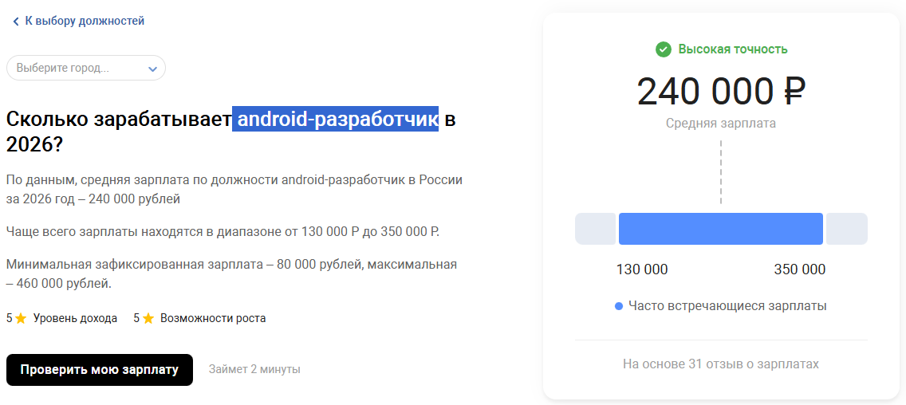

## Мобильная разработка

или

### Что такое Android и с чем его едят

Начнём с приятного.

**Зарплаты**

Зарплаты мобильных разработчиков стабильно остаются высокими по рынку IT.
Android-разработчиков объективно меньше, чем веб-разработчиков.

При этом почти каждая крупная компания хочет иметь своё мобильное приложение.
Иногда даже не потому, что без него нельзя, а потому что *так принято*.
Отсутствие приложения всё чаще воспринимается как признак «несерьёзного» продукта.

---

### Почему именно мобильное приложение, а не сайт?

Если сильно упростить — потому что мобильное приложение живёт **внутри устройства пользователя**, а сайт — снаружи.

Приложение всегда под рукой.
Оно запускается одним нажатием, не требует открытия браузера, повторной авторизации и ожидания загрузки интерфейса. Даже при плохом интернете приложение может работать частично или полностью оффлайн — сайт в этот момент просто не существует.

Вторая важная причина — **интеграция с системой**.
Мобильное приложение — это часть операционной системы. Оно понимает системные темы, реагирует на настройки пользователя, может подстраиваться под тёмный режим, размер шрифтов, язык и поведение устройства в целом.
Сайт живёт в песочнице браузера и никогда не будет чувствовать себя «родным» так же глубоко.

Третья причина — **доступ к возможностям устройства**.
Камера, микрофон, контакты, геолокация, push-уведомления, фоновые задачи — всё это в мобильной разработке является нормой, а не костылём.
Да, веб умеет многое, но на мобильных платформах это по-прежнему работает стабильнее и предсказуемее.

Ну и последняя, но очень важная причина — **поведение пользователей**.
Люди проводят большую часть времени именно в приложениях.
Если сервис уже установлен, ему доверяют больше, его открывают чаще, к нему возвращаются охотнее.
С точки зрения бизнеса приложение — один из самых эффективных способов удержания пользователя.

---

### Что такое Android

Android — это операционная система, изначально созданная для мобильных устройств, но со временем вышедшая далеко за их пределы.

Сегодня Android работает не только на смартфонах, но и на:

* умных часах
* телевизорах
* автомобильных системах
* интерактивных панелях
* кассовых аппаратах
* ноутбуках и гибридных устройствах

Фактически Android — это платформа для устройств с ограниченными ресурсами, где важно уметь работать аккуратно и эффективно.

Система построена на базе ядра Linux, но поверх него добавлен огромный слой собственных компонентов, сервисов и ограничений.
Разработчик работает не напрямую с Linux, а с Android SDK — набором инструментов и API, которые задают правила игры.

Что именно происходит внутри Android и как он управляет приложениями, мы подробно разберём в следующей лекции.

---

### Особенности разработки под Android

Android-приложение может играть очень разные роли.

Часто это второй frontend для существующего backend’а.
Веб-клиент и мобильное приложение обращаются к одному и тому же API, но по-разному показывают данные и по-разному взаимодействуют с пользователем.

Но Android-приложение может быть и полностью автономным.
Трекеры тренировок, заметки, текстовые редакторы, файловые менеджеры, медиаплееры — всё это может работать вообще без сервера.

За счёт этого Android одновременно совмещает плюсы и минусы frontend-разработки и desktop-приложений.
С одной стороны — интерфейс и взаимодействие с пользователем, с другой — доступ к системе и локальным ресурсам.

Отдельная особенность — **адаптивность**.
Устройств на Android огромное количество. Они отличаются:

* размером экрана
* разрешением
* объёмом памяти
* производительностью
* версиями системы

Приложение должно корректно работать на всём этом зоопарке.
SDK сильно помогает разработчику, но полностью проблему не решает — учитывать разнообразие устройств всё равно приходится.

---

### Потребности разработчика

Для Android-разработки используется **Android Studio** — официальная IDE от Google.
Она мощная, удобная… и довольно прожорливая.

Для комфортной работы понадобится:

* минимум 16 ГБ оперативной памяти
* терпение при первой индексации проекта
* и привычка периодически перезапускать IDE без чувства вины

Это не баг, это часть профессии.

---

В итоге Android-разработка — это не «просто ещё один frontend».
Это отдельный мир со своими правилами, ограничениями и возможностями.

И прежде чем писать первый экран, полезно понять, **на какой платформе мы вообще работаем**.
С этим как раз и начнём в следующей лекции.
