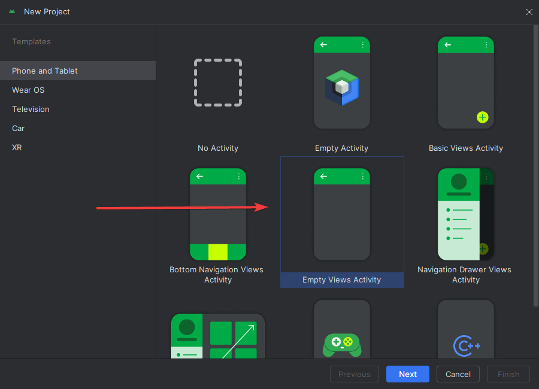
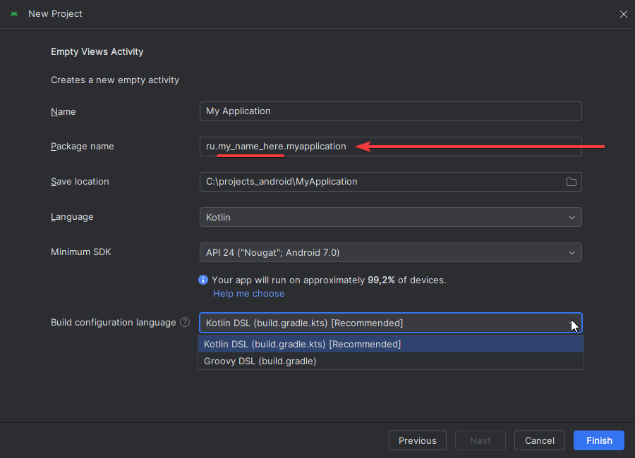

## 1 практическая

**Кратко:**
Создание проекта, Hello World, подключение зависимостей, знакомство с Gradle + IDLE, создание дизайна, git

Суть задания:

### 1 - Создание проекта в Android Studio.

Вам нужно [установить](https://developer.android.com/studio) Android Studio, создать свой проект, пакет **обязательно** должен включать Ваше имя и быть уникальным. 

Обязательно выбираем Empty View Activity.

Обычный Empty Activity это Jetpack Compose. Его мы будем изучать далее, но не сейчас

Язык конфигурации можете выбрать любой, Google советует ставить Kotlin, но большинство старых мануалов и курсов написано на Groovy.

Сильно они не отличаются, вопрос удобства. Сам предпочитаю Groovy.

### 2 - Hello World

Все, чего Вам нужно добиться - Hello World посередине экрана смартфона. Это старт проекта, так что многого не требуется.

### 3 - GIT

Уникальность и в целом проверка Ваших работ будет проводиться по Вашей git истории. Так будет легче и проверяющим, и Вам, так как работы смогут проверяться гораздо быстрее, чем проверка установкой.

**Задача**
Создайте git репозиторий внутри вашего проекта (это делается прямо в Android Studio), загрузите его любой удаленный сервис (github, gitlab, gitverse) Ваш созданный проект. 

### 4 - UI + Figma

Придумайте дизайн Вашего будущего приложения. Не стоит строить структуру флоу пользователя, просто создайте элементы, которые будут часто использоваться (кнопки, текстовые поля, цветовая схема белой/темной темы и тд), чтобы потом из них в будущем строить общий дизайн

Советую опираться на референсы других приложений.

### Критерии приемки

- Пакет приложения содержит имя студента
- Присутствует ссылка на git с первым init коммитом
- Созданный проект работает на XML, а не на Jetpack Compose

### Что прикреплять

zip файл, в котором:
- zip созданного проекта
- README.txt с
    - ссылкой на созданный удаленный git repo
    - ссылкой на figma
- Скрин получившегося UI в figma
- Скрин экрана работающего приложения (Hello World)